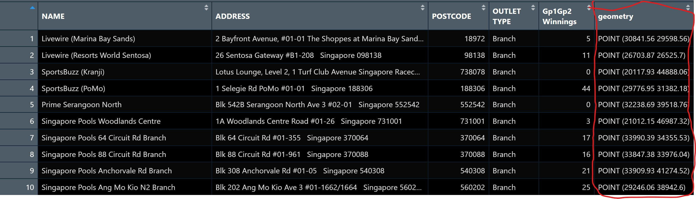

# 1 Learning Outcome

In this hands-on exercise, you will learn how to create a proportional symbol map showing the number of wins by Singapore Pools’ outlets using an R package called **tmap**:

-   To import an aspatial data file into R.

-   To convert it into simple point feature data frame and at the same time, to assign an appropriate projection reference to the newly create simple point feature data frame.

-   To plot interactive proportional symbol maps.

# 2 Getting started

```{r}
pacman::p_load(sf, tmap, tidyverse)
```

# 3 Geospatial Data Wrangling

## 3.1 The data

The data set use for this hands-on exercise is called *SGPools_svy21*. The data is in csv file format.

Figure below shows the first 15 records of SGPools_svy21.csv. It consists of seven columns. The XCOORD and YCOORD columns are the x-coordinates and y-coordinates of SingPools outlets and branches. They are in [Singapore SVY21 Projected Coordinates System](https://www.sla.gov.sg/sirent/CoordinateSystems.aspx).

## 3.2 Data Import and Preparation

The code chunk below uses *read_csv()* function of **readr** package to import *SGPools_svy21.csv* into R as a tibble data frame called *sgpools*.

```{r}
sgpools <- read_csv("data/aspatial/SGPools_svy21.csv")
```

After importing the data file into R, it is important for us to examine if the data file has been imported correctly.

The code chunk below shows list() is used to do the job.

```{r}
list(sgpools) 
```

Notice that the *sgpools* data in tibble data frame and not the common R data frame.

## 3.3 Creating a sf data frame from an aspatial data frame

The code chunk below converts sgpools data frame into a simple feature data frame by using *st_as_sf()* of **sf** packages

```{r}
sgpools_sf <- st_as_sf(sgpools, 
                       coords = c("XCOORD", "YCOORD"),
                       crs= 3414)
```

Things to learn from the arguments above:

-   The *coords* argument requires you to provide the column name of the x-coordinates first then followed by the column name of the y-coordinates.

-   The *crs* argument required you to provide the coordinates system in epsg format. [EPSG: 3414](https://epsg.io/3414) is Singapore SVY21 Projected Coordinate System. You can search for other country’s epsg code by refering to [epsg.io](https://epsg.io/).

Figure below shows the data table of *sgpools_sf*. Notice that a new column called geometry has been added into the data frame.



# 4 Drawing Proportional Symbol Map

The code chunks below are used to create an interactive point symbol map.

```{r}
tmap_mode("view")
tm_shape(sgpools_sf) + 
  tm_bubbles(fill = "red",
           size = 1,
           col = "black",
           lwd = 1)
```

## 4.1 Make it proportional

To draw a proportional symbol map, we need to assign a numerical variable to the size visual attribute. The code chunks below show that the variable *Gp1Gp2Winnings* is assigned to size visual attribute.

```{r}
tm_shape(sgpools_sf) + 
  tm_bubbles(fill = "red",
             size = "Gp1Gp2 Winnings",
             col = "black",
             lwd = 1)
```

## 4.2 Lets give it a different colour

The proportional symbol map can be further improved by using the colour visual attribute. In the code chunks below, *OUTLET_TYPE* variable is used as the colour attribute variable.

```{r}
tm_shape(sgpools_sf) + 
  tm_bubbles(fill = "OUTLET TYPE", 
             size = "Gp1Gp2 Winnings",
             col = "black",
             lwd = 1)
```

## **4.3 I have a twin brothers :)**

An impressive and little-know feature of **tmap**’s view mode is that it also works with faceted plots. The argument *sync* in *tm_facets()* can be used in this case to produce multiple maps with synchronised zoom and pan settings.

```{r}
tm_shape(sgpools_sf) + 
  tm_bubbles(fill = "OUTLET TYPE", 
             size = "Gp1Gp2 Winnings",
             col = "black",
             lwd = 1) + 
  tm_facets(by= "OUTLET TYPE",
            nrow = 1,
            sync = TRUE)
```

Before you end the session, it is wiser to switch **tmap**’s Viewer back to plot mode by using the code chunk below.

```{r}
tmap_mode("plot")
```

# Reference

-   Kam, T. S. (2024). *Visualising Geospatial Point Data.* <https://r4va.netlify.app/chap22>
