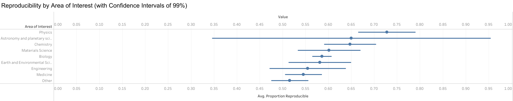
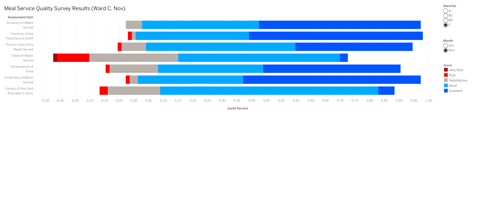

## 1. Standard Deviation Plot

[Link](https://public.tableau.com/views/agesexpyramid_inclass_ex3/Dashboard1?:language=en-US&publish=yes&:sid=&:redirect=auth&:display_count=n&:origin=viz_share_link) to the publish

## 2. Likert Plot

[Link](https://public.tableau.com/app/profile/son.pham1375/viz/inclassex4b/Dashboard1) to the publish
